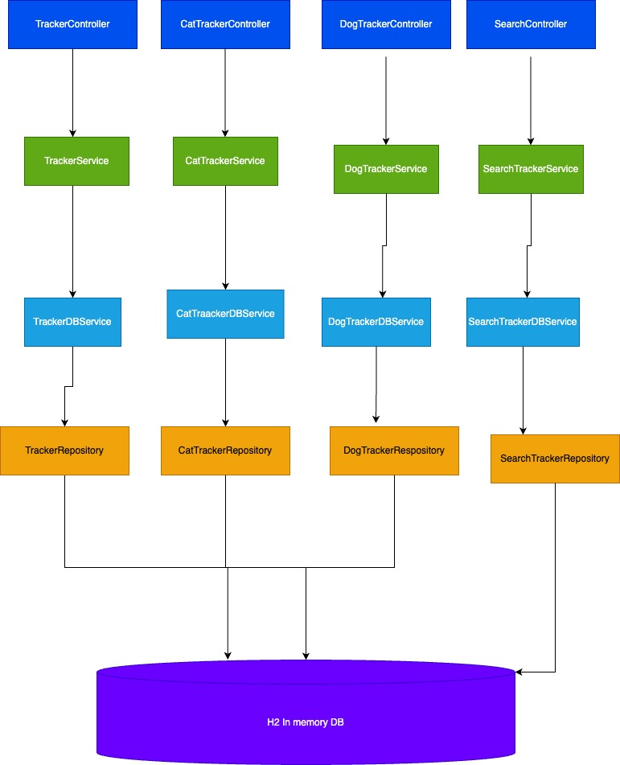

# Pet-Tracker-Service
Pet Tracking Rest Api

## Getting Started
* Java 23 is required.
* The project using Spring Boot framework.
* The project is built with Gradle (packaged within the project itself).
* The application runs on port 8080.

## To Launch:
To launch the application follow instructions as per your case:

### Gradle:
From within project directory run following command  (follow as per your case):
* From git bash, run following command:

  `./gradle run`
* From windows command prompt:

  `gradlew run`

### From IntelliJ IDE.
* Run `Main` from `PetTrackerApplication.java`.

## APIs
For Details input and output please refer to the Swagger API. 
Swagger url will be available when application will  run  
Swagger url:[http://localhost:8080/swagger-ui/index.html]
## Register
* Register/dog/Tracker-> This will register the dog tracker based upon Owner Id,Tracker Type. Since this api will only be used for Dog
* Register/cat/tracker -> This api register Cat based upon Owner id and Tracker Type.

## Tracker Status
* tracker/cat/lost -> To update the tracker status whether it is lost or not. True is lost. False is not lost.

## Search
* search/pet-tracker-type -> Search Tracker information by pet Type and Tracker Type.
* search/outside-power-zone-> Search whether Tracker is outside power zone or inside.
* search/id -> Search Tracker by Tracker id

### Assumption
* Customer will buy the tracker and will register it with Tracker type and OwnerId;   
* Tracker Id will be generated by Pet Tracking Application.
* Tracker will become out of zone by sending tracker id and zone status.

### Architecture
Vertical Domain Slicing Architecture pattern is used in this project.
Requirement is divided into below layers
* Presentation Layer: Responsible for Controller and external input
* Service Layer: Responsible for Domain Layer and Calling Infrastructure Layer.
* Infrastructure Layer: Responsible for Calling Data base via Repository.

### Code Structure
* src/main/java/com.tracker-> main package
* src/main/java/com.tracker.cat-> covers the requirement for Cat Tracker
* src/main/java/com.tracker.dog-> covers the requirement for Dog Tracker
* src/main/java/com.tracker.search-> covers the requirement for Search Tracker
* src/main/java/com.tracker.entity-> contains database entity
* src/main/java/com.tracker.config -> contains spring configuration
* src/main/java/com.tracker.search-> covers the requirement to update tracker zone status

### To Do
* Add Authentication
* Add Authorization
* Add Https for secure connection
* Docker for containerization
* Add integration Test for Tracker Controller and some more test to increase coverage

